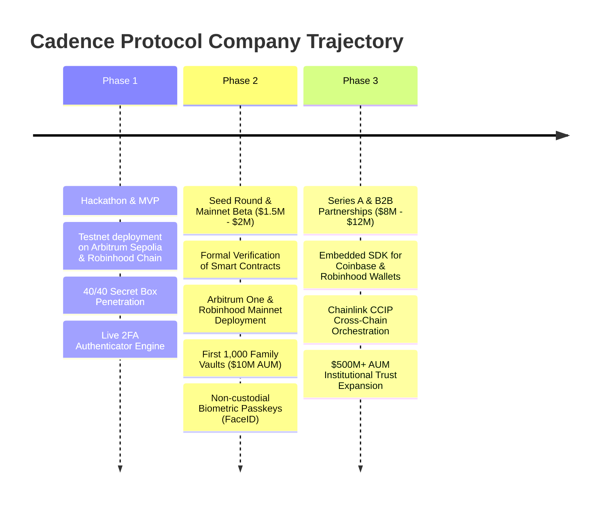

# Cadence Protocol — Market Potential, Business Case & Company Launch Thesis

> *"Cadence secures regulated, yield-bearing family wealth for the next generation of retail investors — not speculative crypto for DeFi natives."*

---

## Executive Summary: The Venture Hypothesis

Most Web3 hackathon projects are clever technical toys: a new DEX aggregator, a meme-token lottery, or a complicated derivative protocol built for DeFi natives to trade against each other.

**Cadence Protocol is fundamentally different.** It solves a real, existential human problem that affects **580+ million crypto owners worldwide** and bridges into the **$84 Trillion "Great Wealth Transfer"** occurring over the next two decades.

Cadence is designed from day one not merely as a protocol experiment, but as the **first version of an enduring fintech and estate-planning company**. By replacing fragile dead man's switches and centralized custodial trusts with a self-custodial Proof-of-Life consensus engine, client-side zero-leak encryption, autonomous yield-bearing distribution streams, and an end-to-end Encrypted Legacy Box with live 2FA Google Authenticator generation, Cadence turns an anxious self-custody experiment into a permanent family wealth institution.

---

## 1. Market Potential & Macro Tailwinds: The Trillion-Dollar Demographic Wave

```
              ┌─────────────────────────────────────────────────────────────┐
              │          $84 TRILLION "GREAT WEALTH TRANSFER"               │
              │  (Boomers & Older Gen-X passing assets to Next-Gen Heirs)   │
              └──────────────────────────────┬──────────────────────────────┘
                                             │
                       ┌─────────────────────┴─────────────────────┐
                       ▼                                           ▼
         ┌───────────────────────────┐               ┌───────────────────────────┐
         │     $3T+ DIGITAL ASSETS   │               │   $100B+ TRAPPED WEALTH   │
         │  580M+ Global Crypto &    │               │  Lost forever in dead EOAs│
         │  Fintech Asset Holders    │               │  & inaccessible exchanges │
         └─────────────┬─────────────┘               └─────────────┬─────────────┘
                       │                                           │
                       └─────────────────────┬─────────────────────┘
                                             ▼
                               ┌───────────────────────────┐
                               │     CADENCE PROTOCOL      │
                               │  The Self-Custodial Trust │
                               └───────────────────────────┘
```

### A. The $100 Billion Graveyard
An estimated **20% of all mined Bitcoin** (over $200B at current market valuations) and tens of billions in Ethereum, stablecoins, and centralized exchange balances are already permanently inaccessible due to sudden death, incapacitation, or lost keys. Every year that passes without an estate standard makes this stranded wealth compound.

### B. The $84 Trillion "Great Wealth Transfer"
Over the next 20 years, older generations will transfer an estimated **$84 trillion** to Millennials and Gen-Z. A rapidly expanding fraction of this wealth is held in digital assets (Robinhood portfolios, Coinbase accounts, hardware wallets, and stablecoins). This next generation expects modern, consumer-grade digital estate tools rather than paper probate and costly legacy attorneys.

### C. The Shift to Regulated, Yield-Bearing Stablecoins
With institutional adoption of **Paxos USDG**, Circle USDC, and tokenized Treasuries (BUIDL, Ondo), cryptocurrency is transforming from speculative casino tokens into yield-bearing family savings. Families do not want to risk these assets on brittle dead man's switches or custodial trusts vulnerable to institutional insolvency.

---

## 2. A Crystal-Clear User Base: 3 Target Customer Personas

| Persona | Who They Are | Their Burning Pain Point | Why Cadence Solves It |
| :--- | :--- | :--- | :--- |
| **1. The Retail Family Accumulator (Ages 30–55)** | Has $15k–$250k in crypto across Coinbase, Robinhood, and MetaMask. Has a spouse and young children. | *"If I get hit by a car tomorrow, my spouse has zero idea how to find my seed phrases or log into my exchange. My family gets nothing."* | **Effortless UX:** Assisted 1-Click QR deposits from Coinbase/Binance, automated heartbeat check-ins, and plain English without crypto jargon. |
| **2. The Web3 Founder / Crypto Native** | Holds $500k–$10M+ across tokens, multi-sigs, DAOs, and cold storage. | *"Traditional estate attorneys charge $15k, know nothing about Web3, and want my private keys on paper in a safe deposit box. That is an unacceptable security hazard."* | **Zero-Leak Cryptography:** Client-side ECIES encryption, blinded Merkle trees, zero plaintext on-chain, and anti-drainer circuit breakers. |
| **3. The Grieving Heir (Non-Technical)** | Non-crypto spouse, parent, or adult child who just lost a loved one. | *"I don't know what a gas fee or private key is, and the exchange is asking for a 6-digit Google Authenticator code that was on my deceased partner's locked phone."* | **Zero-Friction Recovery:** Ephemeral 1-click wallet login, streaming income (Cadence Streams) instead of an overwhelming lump-sum, and a **live, ticking 2FA Google Authenticator generator** in browser RAM. |

---

## 3. The Business Model: How This Scales to $100M+ ARR

Cadence operates with one of the cleanest, highest-margin monetization structures in fintech because it captures wealth-management economics without the extractive overhead of legacy trusts.

```
                    ┌────────────────────────────────────────────────────────┐
                    │                   CADENCE REVENUE                      │
                    └───────────────────────────┬────────────────────────────┘
                                                │
         ┌──────────────────────────────┼──────────────────────────────┐
         ▼                              ▼                              ▼
┌──────────────────┐           ┌──────────────────┐           ┌──────────────────┐
│   AUM PROTOCOL   │           │ PRO SUBSCRIPTION │           │    B2B2C SDK     │
│   YIELD SPREAD   │           │   (RETAIL SAAS)  │           │   (WHITE-LABEL)  │
│  25 - 50 bps on  │           │  $99 - $299/year │           │ Revenue share on │
│  unvested assets │           │   advanced vault │           │ Robinhood/CEXs   │
└──────────────────┘           └──────────────────┘           └──────────────────┘
```

### Stream 1: AUM Yield Performance Spread (Core Engine)
- Unvested estate assets in **Cadence Streams** continuously generate yield via production lending adapters (Aave v3) or regulated stablecoin yield (Paxos USDG pegged to published Robinhood Earn at 7.00% APY).
- Cadence captures a modest **25 to 50 bps (0.25% – 0.50%)** performance spread on streaming capital.
- **Unit Economics at Scale:**
  - **$100M AUM:** $500,000 ARR
  - **$1B AUM:** $5,000,000 ARR
  - **$10B AUM:** $50,000,000 ARR

### Stream 2: B2C SaaS Premium Tier ("Cadence Family Office")
- **Free Tier:** Basic vaults under $10,000 with standard Proof-of-Life heartbeats.
- **Pro Tier ($99 – $299/year or $999 Lifetime):**
  - Unlimited Off-Chain Legacy Boxes.
  - Live in-browser RFC-6238 2FA Authenticator preservation.
  - Multi-channel heartbeat alerts (automated SMS, phone call, and email reminders).
  - Legal will PDF generation linking on-chain Merkle roots to state estate documentation.
  - Multi-guardian quorum coordination and backup guardian nomination.

### Stream 3: B2B2C White-Label & Embedded Wallet SDK
- Distribution is king. Rather than acquiring every user individually, Cadence offers an **"Estate Planning SDK"** for Coinbase Wallet, Robinhood Crypto, Phantom, Rainbow, and Ledger.
- Wallets offer *"Protect Your Family in 1-Click"* as a native setting, splitting subscription and yield fees with Cadence.

---

## 4. Defensible Moats & Negative Churn

### A. Structural Negative Churn (The Ultimate Moat)
In typical SaaS or DeFi protocols, users deposit capital and withdraw it two weeks later to chase higher yields. **Estate planning has a 5-to-25+ year time horizon.** Once an estate vault is created and funded, that capital remains in the protocol for years or decades until death occurs.

### B. The Viral Multi-Player Acquisition Loop
Every single vault created on Cadence requires:
- **1 Benefactor** (Owner)
- **2 to 3 Guardians** (Close friends, family, trusted advisors)
- **1 to 5 Beneficiaries** (Spouses, children, heirs)

$$\text{1 Vault} = 4 \text{ to } 9 \text{ High-Intent Crypto Users Onboarded}$$

When guardians and heirs experience Cadence’s dashboard, telemetry, and smooth UX, they are presented with an immediate prompt: *"Your friend trusted you to protect their family. Is your own family protected?"* **Customer Acquisition Cost (CAC) trends toward zero.**

### C. Solved the "Unsolved" 2FA Barrier
Every competitor (Sarcophagus, Inheriti, Safe) failed to solve the off-chain reality: **a password without a 2FA code is completely useless.** 
Cadence’s breakthrough—generating live, synchronized RFC-6238 Google Authenticator codes inside volatile browser RAM without storing keys on any cloud server—gives Cadence a massive defensive moat that traditional trusts and Web3 competitors cannot match.

---

## 5. Competitive Comparison: Why Cadence Wins

| Capability / Metric | Sarcophagus | Inheriti | Safe (HeirSafe) | Traditional Trust | **Cadence Protocol** |
| :--- | :--- | :--- | :--- | :--- | :--- |
| **Execution Layer** | Decrypts seed phrase | Reconstructs secret shards | Transfers Safe ownership | Legal / Custodial | **Direct On-Chain Vault Settlement** |
| **Payout Mechanics** | Lump sum (manual) | Lump sum (manual) | Lump sum (100% dump) | Custodial transfer | **Per-Second Linear Streaming (Cadence Streams)** |
| **Idle Capital Yield** | 0% (Idle payload) | 0% (Idle payload) | 0% (Unmanaged) | Variable custodial | **Modeled 7.00% USDG Earn Peg & Aave v3 Adapter** |
| **Off-Chain Secret Box** | Seed phrase only | Password fragments | ❌ None | Manual forms | **✅ Encrypted Vault Box (AES-256 + ECIES on IPFS)** |
| **Live 2FA Generation** | ❌ None | ❌ None | ❌ None | ❌ None | **✅ Live RFC-6238 Google Authenticator in RAM** |
| **Anti-Drainer Defense** | ❌ None | ❌ None | ❌ None | ⚠️ Support delay | **✅ Instant Guardian Pause & Cold Wallet Redirection** |
| **Estate Privacy** | ⚠️ Public on-chain | ⚠️ Hardware-dependent | ❌ Public mappings | ❌ Identity doxxing | **✅ ECIES-secp256k1 + Blinded Merkle Trees** |
| **False-Alarm Cancel** | Periodic re-wrap | Manual app login | Direct owner tx | Legal affidavit | **✅ EIP-712 Relayed Stealth Cancel (0 Gas Linkage)** |
| **Consensus Security** | Archaeologist staking | SSDP validator shards | Single timeout timer | Centralized signers | **✅ 2-of-3 Guardian Resilience Quorum + 72h Window** |
| **Heir Onboarding** | High (CLI / Sarco) | High (SafeKey token) | Moderate (Web3 wallet) | Low (Web2 portal) | **✅ ERC-4337 Smart Accounts (Gasless Claims)** |
| **Pricing Model** | SARCO token + gas | Proprietary hardware | Free module + L1 gas | $250 – $1,800+/yr | **Zero Subscriptions / Low AUM Performance Spread** |

---

## 6. Why Cadence Feels Like V1 of a Real Company

| Traditional Hackathon Project | Cadence Protocol (V1 Company) |
| :--- | :--- |
| Focuses on complex DeFi yield farming or speculative tokens | Focuses on capital preservation, regulated stablecoins (USDG), and lending yields |
| Cryptic UX with raw hex inputs, gas calculations, and tech jargon | **Apple/Fintech UX:** 1-Click QR deposits from Coinbase/Binance, plain English |
| Doxxes family wealth and heir addresses in public smart contract storage | **Zero-Leak Cryptography:** Asymmetric ECIES + blinded 32-byte Merkle roots |
| Dumps 100% of the estate in one lump sum (phishing bait) | **Cadence Streams:** Linear per-second vesting with anti-drainer circuit breakers |
| Ignores off-chain accounts (Coinbase, Kraken, 1Password) | **Encrypted Legacy Box + Live 2FA Google Authenticator Engine** |
| 2–3 rudimentary test scripts | **Comprehensive Verification:** 257 Foundry tests, 40 penetration tests, 0 Slither bugs |

---

## 7. The 3-Phase Execution Roadmap (From Buildathon to Series A)



### Phase 1: Seed Round & Security Hardening (Months 1–6)
- Raise a **$1.5M – $2M seed round** from fintech and crypto-native angel syndicates.
- Complete formal verification and tier-1 smart contract audit (OpenZeppelin / Trail of Bits).
- Roll out biometric WebAuthn / Passkeys so non-technical guardians can approve consensus using their phone’s TouchID/FaceID without touching browser extensions.

### Phase 2: Mainnet Launch & Early Traction (Months 6–12)
- Deploy to Arbitrum One and Robinhood Chain mainnet.
- Launch the "Cadence Family Protection Guarantee" with integrated smart contract cover (Nexus Mutual).
- Reach **$25M in Vault AUM** across 2,500 active families.

### Phase 3: Wallet Distribution & Institutional Expansion (Year 2+)
- Partner with major self-custodial wallet providers (Coinbase Wallet, Phantom, Rainbow) to integrate Cadence as an in-app feature.
- Expand into hybrid legal wrappers (linking on-chain Merkle roots to state-registered revocable living trusts in US/UK/Singapore jurisdictions).
- Scale to **$500M+ AUM**.

---

## 8. Non-Custodial Architecture & Trust Guarantee: Can Cadence Access User Vaults?

> **Direct Answer: No. Cadence can NEVER access, control, freeze, or withdraw from any user vault.**

Trust is the single most critical asset in estate planning. The protocol is engineered with mathematical and cryptographic guarantees ensuring complete self-sovereignty:

1. **User-Owned Smart Contracts (Zero Protocol Admin Keys):**
   - Every vault deployed through `OneClickInheritanceVault.sol` designates the user's wallet as the immutable contract `owner`.
   - Cadence holds **zero protocol admin keys**, **no multi-sig master overrides**, and **no developer backdoors**.
2. **Zero Drain or "Emergency Withdraw" Functions:**
   - Contract code contains **no emergency withdrawal functions** or admin rescue mechanisms.
   - The contracts are **immutable** and **non-upgradeable** (no UUPS or transparent proxy architecture). Once deployed, bytecode cannot be modified or replaced.
3. **Cryptographically Restricted Withdrawals:**
   - Funds can exit the vault **only** when Proof-of-Life Consensus reaches `Finalized` (inactivity timer lapses + 2-of-3 guardian consensus attestations + 72-hour contest grace window elapses without owner cancellation).
   - Capital transfers **directly to the authenticated beneficiary's address** verified via Merkle proof against the blinded `allocationRoot` — never touching Cadence.
4. **Zero Knowledge on Off-Chain Secrets:**
   - The Encrypted Legacy Box is sealed client-side in the user's browser using **AES-256-GCM** and wrapped with the heir's public key (**ECIES-secp256k1**).
   - Cadence servers, relayers, and IPFS nodes only ever see unreadable ciphertext (`0x...`).
   - The **RFC-6238 live Google Authenticator 2FA engine** executes strictly in the heir's browser RAM upon verified claim. Cadence has zero decryption keys.
5. **Decoupled Infrastructure (Fail-Safe Autonomy):**
   - If Cadence the company or its servers went offline permanently, your vault, funds, consensus rules, and inheritance streams would continue running trustlessly on Arbitrum and Ethereum forever.

---

## 9. Beneficiary Wallet Recovery Matrix: What If an Heir Loses Access?

A common failure mode in legacy inheritance setups is when an heir loses access to the private key of the wallet address initially designated for them. Because Cadence is 100% non-custodial and has zero protocol admin overrides, the protocol guarantees fund safety and heir recovery through **4 defense layers across the vault lifecycle**:

| Layer | Defense Mechanism | Vault Phase | Actor & On-Chain Authority | Security Guarantee |
| :--- | :--- | :--- | :--- | :--- |
| **Layer 1** | **Living Benefactor Merkle Re-Commitment** | `Active` (Living) | Vault Owner (`setAllocationRoot`) | Owner updates the heir's address in 1 click without gas or identity linkage on-chain. |
| **Layer 2** | **Pre-Registered Backup Claim (`claimAsBackup`)** | `Finalized` (Post-Mortem) | Authorized Heir Backup (`registerBackupClaimAddress`) | Heir pre-registers a secondary cold wallet. Claims after an on-chain 72-hour delay/veto window. |
| **Layer 3** | **ERC-4337 Account Abstraction Social Recovery** | Any State | Heir Account Guardians (`BeneficiarySmartAccount.sol`) | Guardians sign threshold recovery to assign a new signing key without altering the contract address. |
| **Layer 4** | **In-Flight Cadence Stream Redirection (`redirectStream`)** | Streaming Distribution | Heir / Guardian (`redirectStream`) | Reroutes remaining unvested streams to a safe cold wallet if keys are lost or compromised during distribution. |

### Detailed Layer Breakdown:
1. **Layer 1: Living Benefactor Dynamic Re-Commitment (`setAllocationRoot`)**
   - If an heir misplaces their wallet while the vault creator is alive, the benefactor navigates to their dashboard, replaces the beneficiary address, and re-commits the Merkle root (`setAllocationRoot`) in a single transaction.
   - Sibling allocations and blinding salts remain client-side encrypted via ECIES, guaranteeing zero on-chain relationship or address linkage.
2. **Layer 2: Pre-Registered Backup Claim Address (`registerBackupClaimAddress`)**
   - Implemented in `InheritanceVault.sol` (`L613–L726`): Beneficiaries can self-sovereignly register a secondary cold wallet or trusted contact directly on-chain (`registerBackupClaimAddress(address backupAddress, uint256 vetoWindow)`).
   - *Strict Beneficiary Autonomy*: Only the beneficiary (`msg.sender`) can set or revoke their backup address. Neither the vault owner nor guardians can tamper with or override it.
   - *Contestable Backup Claim*: If the primary key is lost upon finalization, the backup wallet calls `initiateBackupClaim(address beneficiary)`. A 72-hour delay/veto window opens. If unvetoed, `claimAsBackup()` distributes 100% of the inheritance directly to the backup address.
3. **Layer 3: ERC-4337 Smart Account Social Recovery (`BeneficiarySmartAccount.sol`)**
   - When an heir utilizes an ERC-4337 smart account, key loss is resolved entirely at the account abstraction layer.
   - Nominated recovery guardians (trusted friends, family, institutional custodians, hardware keys) execute an off-chain threshold signature to rotate the account's signing key.
   - The contract address registered in the Cadence vault remains identical, requiring zero modifications to the vault.
4. **Layer 4: In-Flight Cadence Stream Redirection (`redirectStream`)**
   - For inheritance distributed via continuous yield-bearing streams (Cadence Streams), loss of key access or wallet compromise does not forfeit the remaining locked principal.
   - The authorized beneficiary or guardian can execute `redirectStream(address beneficiary, address newRecipient)`, permanently rerouting future linear payouts to a secure hardware wallet.

---

## 10. Guardian Attestation & False-Positive Defense: How Cadence Protects Living Owners

A central challenge in decentralized estate planning is defending against **false-positive inactivity**: *What happens if the owner is alive, but misses a check-in due to travel, hospitalization, or device loss, and guardians attest to inactivity? Will the owner be warned, and can guardians secretly finalize or drain the vault?*

Cadence resolves this with an **automated 4-stage alert pipeline** backed by **immutable smart contract fail-safes**:

1. **Stage 1: Pre-Attestation Warning (Approaching Deadline)**
   - The background Sentinel continuously monitors on-chain deadlines. When $\le 3$ days or 25% of the interval remains, an automated warning is dispatched: `[Cadence] Action Required: Check-in deadline in X hours`, prompting the owner to check in before guardians can act.
2. **Stage 2: Overdue Inactivity Notice (The Instant the Interval Lapses)**
   - Smart contracts reject guardian attestations while the heartbeat is active. The instant the interval lapses, the owner receives an urgent notice: `[Cadence Alert] URGENT: Vault Heartbeat Overdue — Check-In Required`, notifying them that guardians have been requested to attest.
3. **Stage 3: 72-Hour Contest Window (Guardians Attest)**
   - When 2 of 3 guardians attest, **zero funds leave the vault**. An un-bypassable 72-hour Contest Window opens (`ClaimPending` state), the UI switches to an irregular amber ECG waveform (88 BPM Arrhythmia), and an urgent alert is dispatched.
4. **Stage 4: 1-Click Sovereign Stealth Reset (`cancelClaimWithSig`)**
   - The living owner clicks **`RESET PROTOCOL: I'M ALIVE`** on `/contest` and signs an off-chain EIP-712 typed digest. Relayers submit it with **zero gas linkage** to the owner. The contest cancels instantly, guardian attestations are wiped clean, and the locker returns to `Active` (`62 BPM Steady`).

### Why Guardians Can Never Secretly Steal or Drain Assets:
- **Zero Withdrawal Authority:** Guardians have zero access to vault assets in smart contract bytecode.
- **Blinded Merkle Root Lock:** Funds can exit the vault strictly to addresses verified against the owner's blinded `allocationRoot`.
- **Hardcoded 72-Hour Delay:** Payouts cannot be finalized until the full 72-hour challenge countdown elapses without owner cancellation.

