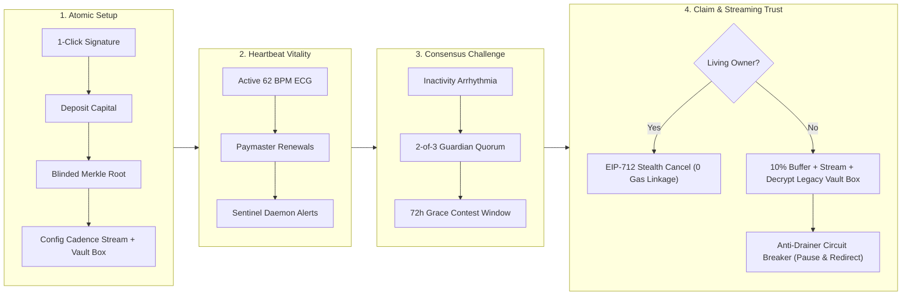

# Cadence — Protocol Architecture & Technical Project Submission

---

## Verified Smart Contracts & Multi-Chain Deployments

Cadence is deployed and verified across three production testnets with deterministic contract addresses:

| Contract / Artifact | Arbitrum Sepolia (`421614`) | Robinhood Chain Testnet (`46630`) | Ethereum Sepolia (`11155111`) |
| :--- | :--- | :--- | :--- |
| **Explorer** | [sepolia.arbiscan.io](https://sepolia.arbiscan.io) | [explorer.testnet.chain.robinhood.com](https://explorer.testnet.chain.robinhood.com) | [sepolia.etherscan.io](https://sepolia.etherscan.io) |
| **Primary USDG Vault** | [`0x07f9e3f0c0bb2d45300711d4f425917fa493525d`](https://sepolia.arbiscan.io/address/0x07f9e3f0c0bb2d45300711d4f425917fa493525d) | [`0x65d7646e9da74e4d537b3f11ebc32acf3a4fe38f`](https://explorer.testnet.chain.robinhood.com/address/0x65d7646e9da74e4d537b3f11ebc32acf3a4fe38f) | [`0x043d02c39B86CAd83E1Bf05728D32d24f6289e74`](https://sepolia.etherscan.io/address/0x043d02c39B86CAd83E1Bf05728D32d24f6289e74#code) |
| **Paxos USDG Token** | [`0x75ef6c3f8cfa9410c6d45924d96aa5b107f166fb`](https://sepolia.arbiscan.io/address/0x75ef6c3f8cfa9410c6d45924d96aa5b107f166fb) | [`0x499fc59f8847f4922850e426fbf9e82d2beaf5e3`](https://explorer.testnet.chain.robinhood.com/address/0x499fc59f8847f4922850e426fbf9e82d2beaf5e3) | N/A (ETH Native) |
| **Consensus Engine** | [`0xe340662aad9cce18ffba38449e585fd8d7c78ae1`](https://sepolia.arbiscan.io/address/0xe340662aad9cce18ffba38449e585fd8d7c78ae1) | [`0x30454c1dc8d230665b2b6693c11937cc8af7f18b`](https://explorer.testnet.chain.robinhood.com/address/0x30454c1dc8d230665b2b6693c11937cc8af7f18b) | [`0x781986427A17432E2d7B4B2C8a36E51a43fe6Bc1`](https://sepolia.etherscan.io/address/0x781986427A17432E2d7B4B2C8a36E51a43fe6Bc1#code) |
| **Guardian Registry** | [`0xe09c19696990fc99c92f8eba070c36ba51cdade7`](https://sepolia.arbiscan.io/address/0xe09c19696990fc99c92f8eba070c36ba51cdade7) | [`0x2d3c214c54a01c13a1e17f1d4112ea95bb3549ee`](https://explorer.testnet.chain.robinhood.com/address/0x2d3c214c54a01c13a1e17f1d4112ea95bb3549ee) | [`0xcFD059B73ca3E2d329Ed7A7A899374968C3d4863`](https://sepolia.etherscan.io/address/0xcFD059B73ca3E2d329Ed7A7A899374968C3d4863#code) |
| **Demo 180s Vault** | [`0x6a555565CAef70d28c8eC038D5Af8475fE5C97b1`](https://sepolia.arbiscan.io/address/0x6a555565CAef70d28c8eC038D5Af8475fE5C97b1) | [`0x6a555565CAef70d28c8eC038D5Af8475fE5C97b1`](https://explorer.testnet.chain.robinhood.com/address/0x6a555565CAef70d28c8eC038D5Af8475fE5C97b1) | [`0x6a555565CAef70d28c8eC038D5Af8475fE5C97b1`](https://sepolia.etherscan.io/address/0x6a555565CAef70d28c8eC038D5Af8475fE5C97b1#code) |
| **Stealth Registry** | [`0x583eC2de840034478a61EF572cea2904bFD8671E`](https://sepolia.arbiscan.io/address/0x583eC2de840034478a61EF572cea2904bFD8671E) | [`0x583eC2de840034478a61EF572cea2904bFD8671E`](https://explorer.testnet.chain.robinhood.com/address/0x583eC2de840034478a61EF572cea2904bFD8671E) | [`0x583eC2de840034478a61EF572cea2904bFD8671E`](https://sepolia.etherscan.io/address/0x583eC2de840034478a61EF572cea2904bFD8671E#code) |
| **Balance Commitment** | [`0x1AeAd0c358f067E6607BAc64CD3A2581547eA1BC`](https://sepolia.arbiscan.io/address/0x1AeAd0c358f067E6607BAc64CD3A2581547eA1BC) | [`0x1AeAd0c358f067E6607BAc64CD3A2581547eA1BC`](https://explorer.testnet.chain.robinhood.com/address/0x1AeAd0c358f067E6607BAc64CD3A2581547eA1BC) | [`0x1AeAd0c358f067E6607BAc64CD3A2581547eA1BC`](https://sepolia.etherscan.io/address/0x1AeAd0c358f067E6607BAc64CD3A2581547eA1BC#code) |
| **Vault Factory** | [`0xac0f91C7d7c3537896248C42fc880F6DFF838622`](https://sepolia.arbiscan.io/address/0xac0f91C7d7c3537896248C42fc880F6DFF838622) | [`0xac0f91C7d7c3537896248C42fc880F6DFF838622`](https://explorer.testnet.chain.robinhood.com/address/0xac0f91C7d7c3537896248C42fc880F6DFF838622) | [`0x9fE46736679d2D9a65F0992F2272dE9f3c7fa6e0`](https://sepolia.etherscan.io/address/0x9fE46736679d2D9a65F0992F2272dE9f3c7fa6e0#code) |
| **Beneficiary Factory**| [`0xebbC0241acb9AE8F52836C3BB4499152c4b5EbAf`](https://sepolia.arbiscan.io/address/0xebbC0241acb9AE8F52836C3BB4499152c4b5EbAf) | [`0xebbC0241acb9AE8F52836C3BB4499152c4b5EbAf`](https://explorer.testnet.chain.robinhood.com/address/0xebbC0241acb9AE8F52836C3BB4499152c4b5EbAf) | [`0x30489c0f3566AF47b71867bc992408B91E500823`](https://sepolia.etherscan.io/address/0x30489c0f3566AF47b71867bc992408B91E500823#code) |

---

## Problem Statement

Over **$100 Billion in cryptocurrency** is estimated to be permanently lost, trapped in inaccessible addresses due to death, incapacitation, or forgotten keys. The ethos of Web3—*"not your keys, not your coins"*—creates a catastrophic blindspot: when a self-custodial asset holder dies, their wealth dies with them.

Today, holders face an impossible choice between two flawed models:

### 1. The Centralized Custodial Trap
Traditional estate trusts or exchange custodians require surrendering private keys or multi-sigs to third parties, destroying self-sovereignty, incurring high probate fees, exposing users to institutional insolvencies, and permanently doxxing families through invasive KYC/AML.

### 2. The Naive On-Chain Dead Man’s Switch
Existing decentralized alternatives rely on brittle smart contract countdown timers:
- **The On-Chain Storage Trap (Zero Privacy):** Storing beneficiary addresses and percentage shares in plaintext public storage slots exposes family net worth and heir identities to anyone calling `eth_getStorageAt`.
- **The Guillotine Timer (False Liquidation):** Simple countdown timers lack nuance. Hospitalization, off-grid travel, or a lost phone triggers irreversible distribution before death is verified.
- **The Lump-Sum "Inheritance Dump" & Drainer Risk:** Dumping 100% of an estate into an heir's wallet in a single transaction makes grieving families instant targets for phishing drainers and impulsive liquidation, while idle capital earns 0% yield.

---

## Solution: Cadence Protocol

> *"Cadence secures regulated, yield-bearing family wealth for the next generation of retail investors — not speculative crypto for DeFi natives."*

**Cadence** is a decentralized, self-custodial, zero-leak digital inheritance protocol built for Arbitrum Sepolia and Robinhood Chain Testnet. It replaces fragile guillotine timers and custodial intermediaries with:
1. **Multi-Signal Proof-of-Life Consensus Engine:** 2-of-3 Guardian Quorum (`GuardianRegistry.sol`) with **Guardian Resilience** non-custodial backup nomination.
2. **Zero Plaintext On-Chain:** Asymmetric **ECIES-secp256k1** client-side encryption and double-hashed blinded Merkle allocation roots (`allocationRoot`).
3. **Zero Gas-Linkage Stealth Recovery:** Living owners dismiss false-alarm claims via off-chain **EIP-712 typed signatures**, relayed with zero gas paid by the owner to eliminate forensic wallet linkage.
4. **Cadence Streams (Flagship):** Autonomous streaming trust releasing an immediate emergency buffer (e.g. 10%) while streaming the remaining 90% per-second.
   - **Production-Ready Yield Architecture:** Cadence Streams integrates production-ready `IAavePool` and `IAToken` interfaces (`InheritanceVault.sol`) with dynamic supply/withdraw accounting. For testnet evaluation—since Aave DAO does not maintain a canonical Aave v3 market on Arbitrum Sepolia—yield is verified against a high-fidelity testnet pool harness (`MockAavePool`), and prepared for canonical Arbitrum One mainnet deployment.
   - **Paxos USDG Yield Engine:** USDG vaults compound yield via a modeled formula pegged directly to published Robinhood Earn USDG yield (7.00% APY).
   - **Lending, Not Staking**: Unvested principal is supplied to lending liquidity pools to earn borrower-paid interest; assets are **never staked**.
   - **Anti-Drainer Defense:** Designated guardians or registered backup addresses can call `pauseStream()` and `redirectStream()` to immediately freeze outflows and redirect unvested streams to a safe cold wallet if an heir is phished.
5. **Arbitrum Stylus WASM Verification:** Merkle allocation verification implemented in Rust as an Arbitrum Stylus WASM contract (`stylus_merkle`), demonstrating sub-cent execution and bit-for-bit equivalence with OpenZeppelin Solidity.
6. **Encrypted Vault Box with Live 2FA Authenticator & Assisted CEX Onramp:**
   - **Off-Chain Legacy Box:** Hybrid AES-256-GCM + ECIES envelope encryption allowing benefactors to attach private credentials (CEX logins, hardware seed shards, 1Password master keys, and personal wills) pinned to decentralized storage (IPFS) and anchored immutably to `InheritanceVault.sol`.
   - **Live Google Authenticator 2FA Engine (RFC-6238):** Heirs inherit not only passwords, but also a live, ticking 6-digit Google Authenticator code generated client-side in the Heir Decryption Portal, bypassing the exchange 2FA lockout barrier.
   - **Assisted 1-Click QR Deposit:** Living owners can fund their wallet during vault setup or top up an existing vault directly from Coinbase, Binance, Kraken, and mobile Web3 wallets via high-contrast dynamic QR codes with zero passwords typed and native exchange FaceID/2FA approval.

---

## Competitive Landscape

| Capability / Metric | Sarcophagus | Inheriti | Safe (HeirSafe) | Casa / Custody | **Cadence Protocol** |
| :--- | :--- | :--- | :--- | :--- | :--- |
| **Execution Layer** | Decrypts seed phrase | Reconstructs secret shards | Transfers Safe ownership | Legal / Custodial | **Direct On-Chain Vault Settlement** |
| **Payout Mechanics** | Lump sum (manual) | Lump sum (manual) | Lump sum (100% dump) | Custodial transfer | **Per-Second Linear Streaming (Cadence Streams)** |
| **Idle Capital Yield** | 0% (Idle payload) | 0% (Idle payload) | 0% (Unmanaged) | Variable custodial | **Modeled 7.00% USDG Earn Peg (Robinhood) & Aave v3 Adapter** |
| **Off-Chain Secret Box** | Seed phrase only | Password fragments | ❌ None | Manual forms | **✅ Encrypted Vault Box (AES-256 + ECIES on IPFS)** |
| **Anti-Drainer Defense** | ❌ None | ❌ None | ❌ None | ⚠️ Support delay | **✅ Instant Guardian Pause & Cold Wallet Redirection** |
| **Estate Privacy** | ⚠️ Public on-chain | ⚠️ Hardware-dependent | ❌ Public mappings | ❌ Identity doxxing | **✅ ECIES-secp256k1 + Blinded Merkle Trees** |
| **False-Alarm Cancel** | Periodic re-wrap | Manual app login | Direct owner tx | Legal affidavit | **✅ EIP-712 Relayed Stealth Cancel (0 Gas Linkage)** |
| **Consensus Security** | Archaeologist staking | SSDP validator shards | Single timeout timer | Centralized signers | **✅ 2-of-3 Guardian Resilience Quorum + 72h Window** |
| **Heir Onboarding** | High (CLI / Sarco) | High (SafeKey token) | Moderate (Web3 wallet) | Low (Web2 portal) | **✅ ERC-4337 Smart Accounts (Gasless Claims)** |
| **Pricing Model** | SARCO token + gas | Proprietary hardware | Free module + L1 gas | $250 – $1,800+/yr | **Zero Subscriptions (Self-Custodial)** |

### Core Moats
1. **Autonomous Streaming Trust vs. Lump-Sum Dump:** Continuous per-second linear vesting protects grieving heirs from impulsive liquidation and wallet drainers.
2. **On-Chain Anti-Drainer Circuit Breakers:** Guardians can freeze and redirect unvested streams (`pauseStream` & `redirectStream`) if an heir is phished.
3. **Zero Plaintext Privacy:** On-chain storage records only opaque 32-byte Merkle roots; allocations are encrypted client-side.
4. **Zero Gas-Linkage Cancellation:** False alarms are dismissed off-chain via EIP-712 signatures, submitted by relayers with zero owner gas.

---

## Product-Market Fit & Viral Retention

- **Structural Retention (Negative Churn):** Estate assets carry a 5-to-20+ year horizon. Once deposited, capital compounds indefinitely. Owners return periodically for routine "proof-of-life" check-ins prompted by the Sentinel daemon.
- **Continuous Stream Engagement:** Beneficiaries interact with Cadence over months or years, tracking per-second vesting accrual and claiming allowances.
- **Multi-Player Acquisition Flywheel (1 User = 5 Participants):** Each vault brings together 1 Owner, 2–3 Guardians, and multiple Beneficiaries. As guardians and heirs experience the protocol, they become natural converters to deploy vaults for their own families with near-zero CAC.
- **1-Click Accessible Onboarding:** `OneClickInheritanceVault.sol` condenses contract deployment, capital deposit, Merkle allocation commitment, and guardian quorum setup into a single wallet signature.

---

## User Experience & Human-Centric Design Philosophy: "Effortlessly Simple for Everyday Families"

> *"It’s not about piling on more and more features — it’s about making the UX effortlessly simple so everyday users never get stuck or overwhelmed."*

Estate planning is already an emotional and intimidating topic. When an everyday retail investor or a grieving heir arrives at Cadence, the last thing they want is cryptic cryptographic steps, confusing 20-word forms, or technical friction.

Every design decision in Cadence is engineered to feel as smooth, clear, and reassuring as an Apple or modern fintech product:

### How We Keep Cadence Frictionless & Human-Centric:

1. **Zero Crypto Jargon in the UI:**
   - Instead of asking users to configure *"ECIES public key envelopes"* or *"asymmetric ciphertexts"*, we give them clean, plain English: **"Deposit with 1 Click"** or **"Unlock Inherited Box"**.
   - Instead of asking for raw technical inputs, smart defaults guide them with intuitive presets (e.g. 5-minute testing for hackathon evaluation vs. 180-day production standard).

2. **The Assisted QR / Deep Link instead of Manual Hassle:**
   - The user doesn't need to copy-paste contract addresses or worry about sending tokens to the wrong network.
   - They tap or scan with **Coinbase / Binance / Phantom / MetaMask**, native FaceID/TouchID confirms it, and it's done.

3. **1-Click Atomic Deployment:**
   - Behind the scenes, Cadence deploys an Aave-connected vault, sets up Proof-of-Life consensus, and registers guardians in **one single transaction** (`OneClickInheritanceVault.sol`). The user clicks once and their family is protected.

4. **Zero-Password Claiming for Heirs:**
   - The heir never has to hunt for a master password or worry about lost passphrases. Connecting their wallet and clicking **"Unlock Allocation"** does all the math and decryption silently in the background in seconds.

---

## Technology Stack & Verification Matrix

### Architecture Components
- **Networks:** Arbitrum Sepolia (`421614`), Robinhood Chain Testnet (`46630`), Ethereum Sepolia (`11155111`).
- **Smart Contracts:** Solidity `^0.8.24` & Rust (Arbitrum Stylus WASM verification crate `stylus_merkle`).
- **Frontend:** Next.js 16 (App Router + Turbopack), React 19, TypeScript 5, Viem `^2.56.3`, Wagmi `^3.7.7`, TanStack Query `^5.102.8`.
- **Styling:** Vanilla CSS Light Editorial ("Pulse") design system, dynamic SVG ECG oscilloscope rhythm, solid white surfaces, `#ECE9EF` borders.
- **Notifications Daemon:** Node.js, Express `^4.21.2`, TypeScript `^5.7.2`, Viem multi-chain watcher, Nodemailer SMTP / Resend API, strict EIP-712 binding verifier (`bindingVerifier.ts`).
- **DeFi & Stablecoin Integrations:**
  - **Aave v3 Yield Architecture:** Production-ready `IAavePool` and `IAToken` interfaces in `InheritanceVault.sol` with dynamic supply/withdraw accounting, verified against a high-fidelity testnet harness (`MockAavePool`) and architected for canonical Arbitrum One mainnet deployment (Aave DAO does not maintain a canonical deployment on Arbitrum Sepolia).
  - **Paxos USDG Yield Engine:** Modeled 7.00% APY compounding yield pegged directly to Robinhood Earn published APY on Robinhood Chain and Arbitrum Sepolia.

### Submission Tags (25 Tags)
`arbitrum`, `stylus`, `rust`, `solidity`, `foundry`, `usdg`, `aave`, `paxos`, `next.js`, `typescript`, `viem`, `wagmi`, `erc-4337`, `account-abstraction`, `eip-712`, `ecies`, `cryptography`, `merkle-trees`, `openzeppelin`, `node.js`, `express`, `resend`, `smart-contracts`, `privacy`, `digital-inheritance`

---

## Complete Protocol Lifecycle: How It Works

### Phase 1: 1-Click Vault Provisioning & Assisted QR Deposit (`/vault/create`)
The owner deposits ETH or Paxos USDG, configures ECIES-encrypted allocations (shares sum to 10,000 bps), configures the optional Off-Chain Legacy Box (with exchange credentials, seed shards, and 2FA setup keys), appoints 2-of-3 guardians with optional backup nomination, and executes deployment in **1 single transaction** via `OneClickInheritanceVault.sol`.
- **Assisted 1-Click QR Deposit Modal:** Users can tap `[⚡ Scan QR / Transfer from Coinbase, Binance, or Mobile App]` to fund their wallet before deployment (or fund an active vault directly) without entering passwords or exporting API keys. Native FaceID/2FA on the exchange app authorizes the transfer.

### Phase 2: Heartbeat Monitoring & Telemetry (`/dashboard`)
The dashboard displays real-time ECG rhythm telemetry (`62 BPM Steady`). Owners check in via standard EOA transactions or gasless ERC-4337 Pimlico paymasters. A shoulder-surfing privacy toggle obscures live balances (`••••••••`). The Sentinel daemon sends automated reminders before check-in intervals expire.

### Phase 3: Multi-Signal Inactivity Challenge (`/contest`)
If the check-in timer lapses, the ECG transitions to an amber arrhythmia (`92 BPM Erratic`). The Sentinel daemon notifies guardians, who connect their wallets to attest on-chain. Achieving a 2-of-3 quorum transitions the vault to `ClaimPending` and opens a 72-hour contest grace window.

### Phase 4: Zero Gas-Linkage Stealth Cancellation
If the owner is alive, they click **`[RESET PROTOCOL: I'M ALIVE]`** to sign an off-chain EIP-712 `CancelClaim` digest. Any relayer broadcasts the reset with zero gas paid by the owner, preserving anonymity and restoring state to `Active`.

### Phase 5: Cadence Streams Claim & Anti-Drainer Protection (`/claim`)
When the contest window concludes, the vault transitions to `Finalized`. The heir connects their wallet, signs an ephemeral message to derive their ECIES key in volatile RAM, decrypts their allocation, and verifies their Merkle proof.
- **Lump-Sum vs. Streaming:** Pays an immediate emergency buffer (10%) and streams the remaining 90% per-second with live yield.
- **Anti-Drainer Defense:** If an heir's wallet is compromised, guardians or registered backups call `pauseStream()` and `redirectStream(newColdWallet)` to rescue all unvested capital.
- **Heir Secret Box Decryption Portal:** If the vault includes an anchored Off-Chain Legacy Box (`beneficiarySecretBoxes`), a prominent golden card alerts the heir: `"📦 Off-Chain Legacy Box Available — Inherited Credentials & Instructions"`. Clicking `[🔓 Decrypt Legacy Instructions]` prompts for an ephemeral EIP-191 signature (`personal_sign` on `"Cadence Legacy Box Decryption Authorization"`), derives the ECIES key in browser RAM, downloads the ciphertext from IPFS, and decrypts the credentials inside an interactive modal (obscured passwords, hold-to-reveal, copy-to-clipboard, personal will letter, and offline JSON/PDF export) with zero disk persistence.
- **Live Google Authenticator 2FA Card:** If the deceased benefactor attached a 2FA TOTP seed key, the modal renders a live, synchronized Google Authenticator card with ticking 30-second countdowns and 1-click OTP copying, giving the heir everything necessary to access exchange accounts legally.

---

## Technical Challenges & Solutions

1. **The "Gas Linkage" De-Anonymization Trap:**
   - *Problem:* Broadcasting cancellations from newly derived stealth addresses requires funding them with gas, creating an on-chain forensic link to the owner.
   - *Solution:* Implemented off-chain **EIP-712 typed signatures** (`CancelClaim`). Relayers broadcast the cancellation; the contract recovers the signer address via `ECDSA.recover` with zero owner gas spent.

2. **The On-Chain Storage Leak Trap:**
   - *Problem:* Storing beneficiary allocations on-chain in public mapping slots exposes family net worth to `eth_getStorageAt`.
   - *Solution:* Contracts store only a 32-byte `allocationRoot`. Allocations and blinding salts are encrypted client-side via **ECIES-secp256k1**. `vm.load` storage-slot audits in Foundry (`AllocationPrivacy.t.sol`) verify zero plaintext exposure.

3. **Single-Beneficiary vs. Multi-Beneficiary Merkle Parity:**
   - *Problem:* In 1-heir vaults (`leaf == root`), standard Merkle libraries crash on empty proof arrays (`[]`).
   - *Solution:* Engineered OpenZeppelin-compliant proof handling in both TypeScript and Solidity, verifying that an empty proof against a single leaf correctly validates against the root.

4. **Eliminating the "Paste Private Key" UI Anti-Pattern:**
   - *Problem:* Requiring users to paste private keys for ECIES decryption is a severe security vulnerability.
   - *Solution:* Beneficiaries sign an ephemeral message (`personal_sign` over deterministic salt). The 32-byte ECIES key is derived in browser memory, decrypts `{ shareBps, salt }`, and is discarded. Zero private keys are ever typed or stored.

5. **Multi-RPC Failover Under High Traffic:**
   - *Problem:* High-frequency polling on public testnet RPCs triggers HTTP 429 rate limits and browser CORS blocks.
   - *Solution:* Implemented Viem `fallback([...])` transports pooling independent CORS-enabled endpoints across Arbitrum Sepolia, Robinhood Chain, and Ethereum Sepolia with 6000ms request timeouts.

6. **The "Inheritance Drainer & Zombie Pulse" Dilemma:**
   - *Problem:* A thief with stolen owner keys could make small transfers to indefinitely reset a dead man's switch ("zombie pulse"). Alternatively, compromising an heir's wallet allows drainer bots to steal a lump-sum inheritance instantly.
   - *Solution:* Enforced strict intentional heartbeats (`checkIn()` only) to eliminate zombie pulses, and built **Cadence Streams** with guardian circuit breakers (`pauseStream` and `redirectStream`) to rescue unvested streams.

7. **The "Off-Chain Secret & Plaintext Exposure" Dilemma:**
   - *Problem:* Real-world wealth involves off-chain accounts: centralized exchange portfolios (Coinbase, Kraken), master passwords (1Password), and cold storage seed shards (Ledger Shamir backups). Storing these on-chain is public suicide, while cloud servers create custodial breach points.
   - *Solution:* Built an end-to-end Client-Side Hybrid Encryption Engine (AES-256-GCM + ECIES). Benefactors encrypt credentials and wills locally in browser memory before pinning to IPFS. The ciphertext CID and wrapped AES key are anchored immutably to `InheritanceVault.sol`. Heirs unwrap and decrypt strictly in volatile browser RAM upon finalized claim with zero disk or cookie persistence.

8. **The 2FA Authenticator Barrier & Password-Free CEX Funding Dilemma:**
   - *Problem:* Passing exchange passwords to heirs is useless because logins are blocked by Google Authenticator (TOTP). Furthermore, forcing living users to type passwords or export API keys to fund their vaults creates severe attack surfaces.
   - *Solution:* Separated the estate lifecycle into two distinct phases. For living owners, built an **Assisted 1-Click QR Deposit Modal** enabling instant transfers from Coinbase/Binance apps approved via native FaceID/2FA without entering passwords or exposing API keys. For post-mortem heir access, built an in-browser **RFC-6238 TOTP Engine** into the Heir Decryption Portal, generating synchronized 6-digit Google Authenticator codes live in RAM from an encrypted seed.

---

## Verification & Audit Compliance Matrix

| Audit / Test Suite | Scope | Target | Result | Status |
| :--- | :--- | :--- | :--- | :--- |
| **Foundry Smart Contract Suite** | All 19 Test Suites | `contracts/test/` | **257 / 257 tests passing** | **PASSED** |
| **Dedicated Secret Box Security Suite** | 6 Security Domains (40 checks) | `frontend/scripts/test-secret-box-security.mjs` | **40 / 40 tests passing** | **PASSED** |
| **RFC-6238 TOTP Engine Suite** | Base32 & HMAC-SHA1 dynamic truncation | `frontend/scripts/test-totp.mjs` | **8 / 8 tests passing** | **PASSED** |
| **Heir Claim Decryption Flow** | E2E In-Memory Decryption | `frontend/scripts/test-heir-claim-decryption-flow.mjs` | **11 / 11 tests passing** | **PASSED** |
| **Hybrid Cryptography Suite** | AES-256-GCM + ECIES + 2FA preservation | `frontend/scripts/test-secret-box-crypto.mjs` | **16 / 16 tests passing** | **PASSED** |
| **Slither Static Analysis (v0.11.6)** | All 55 contracts | `contracts/` | **0 Critical, 0 High, 0 Medium** | **PASSED** |
| **Notifications Security Suite** | 11 Security Regression Suites | `notifications/test/security.test.ts` | **11 / 11 suites passing** | **PASSED** |
| **Frontend ESLint Audit** | 108 source files | `frontend/` | **0 errors, 0 warnings** | **PASSED** |
| **Frontend TypeScript Typecheck** | Strict compilation | `npx tsc --noEmit` | **0 errors (exit code 0)** | **PASSED** |
| **Dependency Security Audit** | Monorepo dependencies | `npm audit` | **0 vulnerabilities** | **PASSED** |
| **Terminology Compliance** | Frontend & Docs Copy | All files | **0 instances of "staking"; strictly lending** | **PASSED** |

---

## What We Learned

1. **Applied Zero-Leak Cryptography:** Combining client-side ECIES-secp256k1 asymmetric encryption with double-hashed blinded Merkle trees enables smart contracts to enforce complex distribution logic without touching plaintext user data.
2. **Arbitrum Stylus WASM Composability:** Demonstrated seamless interoperation between Rust-compiled WASM contracts and Solidity contracts via standard EVM ABI calls on Arbitrum Nitro chains.
3. **Designing for Non-Crypto Heirs:** Inheritance tools must serve non-technical family members. In-memory key derivation and 1-click claim flows prove that institutional-grade privacy and effortless UX can coexist.

---

## What's Next for Cadence

1. **Mainnet Deployment on Arbitrum One & Robinhood Chain:** Production deployment with formal verification of `ProofOfLifeConsensus.sol` and `GuardianRegistry.sol`.
2. **Multi-Asset & DeFi Yield Vaults:** Support automated streaming distribution of additional yield-bearing assets (e.g. Aave aTokens, Lido wstETH).
3. **Cross-Chain Inheritance via Chainlink CCIP:** Monitor heartbeat vitality on Arbitrum while trustlessly orchestrating asset unlocks across Optimism, Base, and Ethereum.
4. **Passkey & WebAuthn Guardian Integration:** Enable non-technical guardians to attest to proof-of-life consensus using device biometrics (FaceID / TouchID) via WebAuthn without installing browser extensions.
